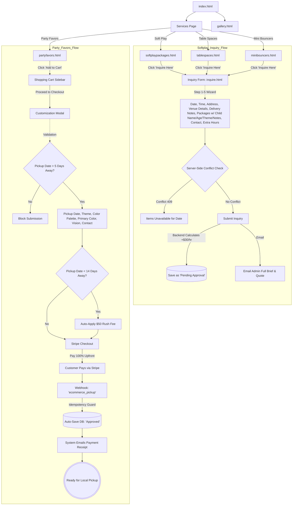
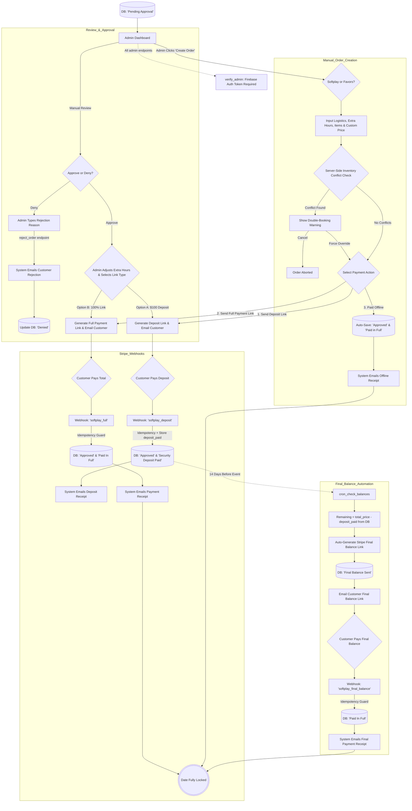
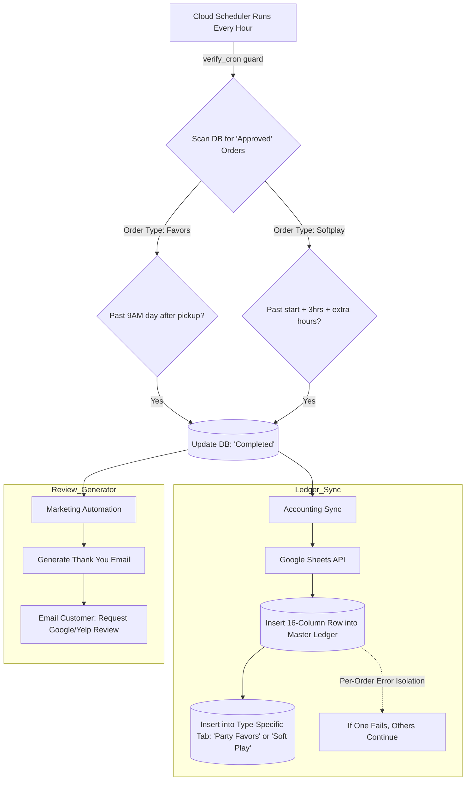
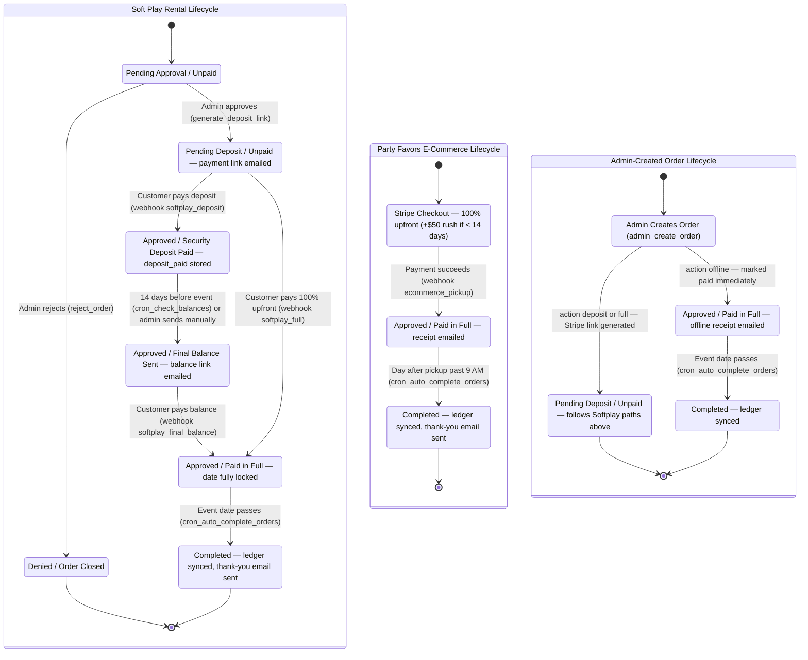

# Lola's Party System

**A full-stack party rental platform built for a real client in Woodbridge, VA**

[View Live Site](https://lolas-party-system.web.app)

---

## About

Lola's Party System is a production party rental web application built for Ms. Cortes, a small business owner in Woodbridge, VA, as part of the IT-493 Senior Capstone course at George Mason University (Spring 2026). Customers browse party rental services — including soft play packages, tablescapes, mini bouncers, and custom party favors — then book online through a 5-step inquiry wizard and pay securely via Stripe. The business owner manages all bookings, generates deposit and final payment links, and tracks orders from a full-featured admin dashboard. Behind the scenes, the system automates email confirmations, balance reminders 14 days before events, post-event thank-you emails, and real-time accounting ledger synchronization via Google Sheets.

---

## Features

- **5-Step Booking Wizard** — Customers select packages, enter event details, choose venue type, and submit inquiries with real-time conflict detection
- **Party Favors E-Commerce** — Browse party favor products with photo lightbox, add to cart, customize per item (child name, theme, colors), and checkout via Stripe
- **Stripe Payment Integration** — Supports deposit-first and full-payment flows, with automated final balance links sent 14 days before events
- **Admin Dashboard** — Full order management with status filters, payment link generation, manual order creation, inventory toggling, and gallery management
- **Photo Gallery** — Firestore-backed masonry grid with category tabs, lightbox viewer, and admin upload/delete controls
- **Automated Email System** — Confirmation emails, deposit receipts, balance reminders, rejection notices, monthly check-ins, and post-event thank-you/review requests
- **Distance-Based Delivery Pricing** — Google Maps Distance Matrix API calculates delivery fees based on distance from Woodbridge, VA (free within 30 miles, $1.25/mile beyond)
- **Automated Cron Jobs** — Cloud Scheduler runs hourly to auto-send balance reminders, auto-complete past orders with ledger sync, send monthly check-in emails, and run daily backups

---

## Architecture

The platform follows a serverless architecture on Google Cloud. Firebase Hosting serves static frontend pages, which communicate with Python Cloud Functions (Gen2) via REST APIs. Cloud Firestore stores all application data, while external services handle payments (Stripe), email (Gmail SMTP), accounting (Google Sheets), and delivery pricing (Google Maps).

<strong>Customer Booking Engine</strong>

<strong>Admin Control & Financial Engine</strong>

<strong>Post-Event Autopilot</strong>

<strong>Order Lifecycle State Machine</strong>

---

## Tech Stack

| Layer | Technology |
|-------|-----------|
| Frontend | HTML5, Vanilla JavaScript, Tailwind CSS (CDN) |
| Backend | Python 3.11, Flask, Google Cloud Functions (Gen2) |
| Database | Google Cloud Firestore (NoSQL) |
| Payments | Stripe Checkout + Webhooks |
| Maps | Google Maps Distance Matrix API |
| Email | Gmail SMTP |
| Ledger | Google Sheets API (gspread) |
| Hosting | Firebase Hosting (multi-site: prod + test) |
| Storage | Google Cloud Storage |

---

## Team

| Name | GitHub | Role / Contributions |
|------|--------|---------------------|
| Armando | [@Armando-ic](https://github.com/Armando-ic) | Project Lead, Backend & DevOps, Cloud Architecture |
| Jerome | *TBD* | *TBD* |
| Rohan | *TBD* | *TBD* |
| Donia | *TBD* | *TBD* |
| Israel | *TBD* | *TBD* |
| Zaid | *TBD* | *TBD* |

*Built as part of IT-493-005 (Senior Capstone) at George Mason University, Spring 2026.*

---

## License

This project is licensed under the MIT License — see the [LICENSE](LICENSE) file for details.
